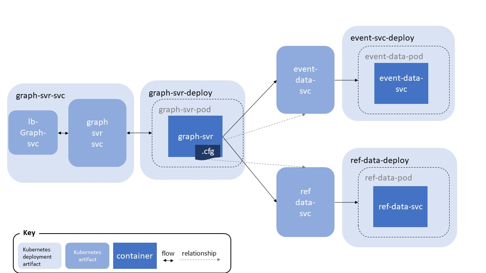

# Kubernetes Setup

The Kubernetes configuration should look as shown in the diagram below:

## Getting Kubectl configured

The simplest way to get a local kubectl configured is to navigate to the OKE instance (from the hamburger *Developer Services --> Kubernetes Clusters*) and then click on the Kubernetes cluster being used. Use the *Access Cluster* button which will popup a dialogue offering access via the cloud shell or Local Access. In the dialogue is a prepared kubectl command to establish the connection.

## Deploying the Kubernetes elements

To build and deploy the Kubernetes elements we have provided windows and shell scripts in each service (deploy-paramd.sh or .bat). This requires the GitHub repository to have been downloaded first, and if necessary the execute permissions set on the shell/batch scripts within the repository. The scripts need to be run from within the folder in which the relevant components reside as they assume the YAML files are in the same directory.

The script will build the container from the downloaded GitHub repository. Then push it into the appropriate OCIR repository. Finally then deploying it and the service definitions.  Each script requires the following parameters:

1. Username e.g. joe.bloggs@oracle.com
2. The auth token generated e.g. 12344555665
3. The name of your tenancy e.g. myTenancy
4. OCI cloud region to deploy into in its 3 letter acronym form e.g. iad for Ashburn.
  